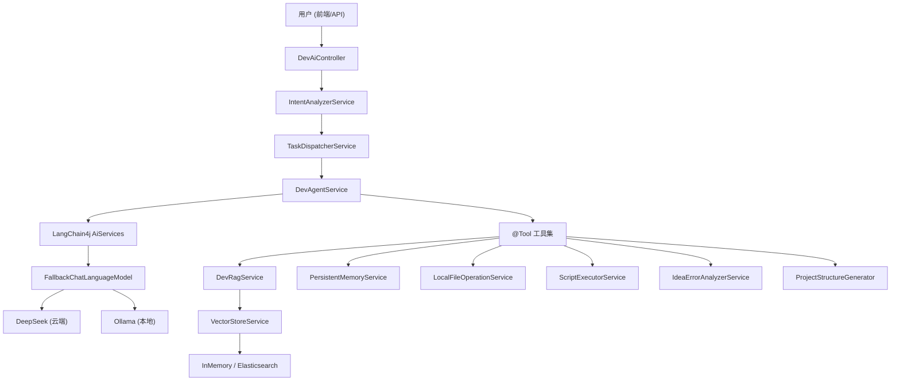

hybridRetrieval# Dev AI Platform

> 🤖 基于 LangChain4j + Spring Boot 3 的本地 AI 开发助手平台  
> 支持 RAG 知识检索、智能任务路由、本地文件操作、项目架构生成、永久记忆蒸馏、Agent 自愈管理

[](https://openjdk.org/)
[](https://spring.io/projects/spring-boot)
[](https://docs.langchain4j.dev/)

## 📖 项目简介

Dev AI Platform 是一个面向开发者的 AI 辅助平台，通过自然语言与 AI 交互，实现代码生成、知识库管理、错误分析、项目搭建等全链路开发辅助能力。

**核心特性：**
- 🧠 **智能路由** — AI 自动识别用户意图，分发到对应处理 Agent
- 🔄 **云端/本地自动降级** — DeepSeek 断网自动切换本地 Ollama，恢复后自动切回
- 📚 **RAG 知识检索** — 支持 PDF 文档入库、OCR 扫描版识别、向量语义检索
- 💾 **永久记忆系统** — 对话自动蒸馏为长期记忆，支持检索、归档、清理
- 📁 **本地文件操作** — AI 直接读写本地文件、创建目录、执行脚本
- 🏗️ **项目架构生成** — 一键生成 Spring Boot 项目结构 + CRUD 模块代码
- 🔍 **IDEA 错误分析** — 扫描编译错误/运行时异常，AI 生成修复方案
- 🔌 **Elasticsearch 支持** — 向量数据持久化到 ES，支持内存/ES 双模式切换
- 🛡️ **Agent 自愈管理** — JSON 配置驱动的健康检查、故障诊断、自动修复策略
- 🖥️ **可视化管理面板** — 前端管理页面，实时展示 Agent 配置、自愈规则、升级策略

## 🏗️ 系统架构



## 🛠️ 技术栈

| 组件 | 技术 | 版本 |
|---|---|---|
| 后端框架 | Spring Boot | 3.5.16 |
| AI 框架 | LangChain4j | 0.36.2 |
| 云端大模型 | DeepSeek API | deepseek-chat |
| 本地大模型 | Ollama (Qwen2.5) | qwen2.5:7b |
| 向量嵌入 | Ollama (nomic-embed-text) | 本地运行 |
| 向量存储 | InMemory / Elasticsearch | 可配置切换 |
| PDF 解析 | Apache PDFBox | 2.0.32 |
| OCR 识别 | Tess4j (Tesseract) | 5.10.0 |
| 定时任务 | Spring Quartz | 内置 |
| JSON 工具 | FastJSON2 | 2.0.32 |

## 📂 项目结构

```
dev-ai-platform/
├── src/main/java/com/devai/devaiplatform/
│   ├── common/
│   │   └── Result.java                    # 统一响应封装
│   ├── config/
│   │   ├── agent/
│   │   │   ├── AgentConfig.java           # Agent 配置 POJO（Lombok，20+ 嵌套类）
│   │   │   └── AgentConfigService.java    # Agent 配置加载服务（启动自动读取）
│   │   ├── AiConfig.java                  # AI 模型配置（DeepSeek + Ollama + 降级）
│   │   ├── FallbackChatLanguageModel.java # 云端/本地自动降级包装器
│   │   └── WebConfig.java                 # Web 跨域配置
│   ├── controller/
│   │   ├── DevAiController.java           # 主 REST API 控制器（含 Agent 配置 API）
│   │   └── FunctionCallingController.java # Function Calling 专用控制器
│   ├── service/
│   │   ├── DevAgentService.java           # 核心 Agent（工具定义 + AiServices）
│   │   ├── IntentAnalyzerService.java     # 意图分析（AI 智能体模式）
│   │   ├── TaskDispatcherService.java     # 任务路由分发
│   │   ├── TaskAnalysisResult.java        # 意图分析结果模型
│   │   ├── TaskIntent.java                # 意图类型枚举（40+种意图）
│   │   ├── DevRagService.java             # RAG 知识检索服务
│   │   ├── VectorStoreService.java        # 向量存储管理（内存/ES 双模式）
│   │   ├── ElasticsearchVectorStoreService.java  # ES 向量存储实现
│   │   ├── PersistentMemoryService.java   # 永久记忆（持久化 + 检索 + 归档）
│   │   ├── MemoryDistillationScheduler.java # 定时批量蒸馏调度器
│   │   ├── OcrService.java               # OCR 图片文字识别
│   │   ├── LocalFileOperationService.java # 本地文件读写操作
│   │   ├── ProjectStructureGenerator.java # Spring Boot 项目结构生成
│   │   ├── ScriptExecutorService.java     # 本地脚本执行引擎
│   │   ├── IdeaErrorAnalyzerService.java  # IDEA 编译/运行时错误分析
│   │   ├── AISummaryService.java          # AI 摘要生成
│   │   └── PromptTemplate.java            # Prompt 模板集合
│   └── DevAiPlatformApplication.java      # 启动类
├── src/main/resources/
│   ├── static/
│   │   ├── index.html                     # 智能对话前端页面
│   │   └── agent-dashboard.html           # Agent 可视化管理面板
│   ├── agent-config.json                  # Agent 全局配置文件（自愈/升级/工具）
│   └── application.properties            # 应用配置
├── scripts/                               # AI 可执行的本地脚本
│   ├── file_list.bat                      # 列出目录
│   ├── file_read.bat                      # 读取文件
│   ├── file_create.bat                    # 创建目录
│   ├── file_copy.bat                      # 复制文件
│   ├── file_search.bat                    # 搜索文件
│   └── file_tree.bat                      # 目录树
├── agent_memory/                          # 记忆持久化存储
│   ├── persistent_memory.json             # 永久记忆库
│   └── pending_conversations.json         # 待蒸馏对话队列
├── src/test/java/
│   └── AgentConfigTest.java               # Agent 配置单元测试（12 个测试用例）
```

## 🚀 快速开始

### 环境要求

| 依赖 | 最低版本 | 说明 |
|---|---|---|
| JDK | 17+ | 必须，Spring Boot 3.x 要求 |
| Ollama | 最新版 | 本地 Embedding + 可选聊天降级 |
| Elasticsearch | 7.x / 8.x | 可选，向量持久化存储 |

### 1. 安装 Ollama 并拉取模型

```bash
# 安装 Ollama: https://ollama.com/download
# 拉取 Embedding 模型（必须）
ollama pull nomic-embed-text

# 拉取聊天模型（可选，用于降级）
ollama pull qwen2.5:7b
```

### 2. 配置应用

编辑 `src/main/resources/application.properties`：

```properties
# DeepSeek API Key（必填）
deepseek.api-key=sk-your-api-key-here

# Ollama 地址（默认本地）
ollama.base-url=http://127.0.0.1:11434

# 向量存储模式: memory（默认）或 elasticsearch
vector.store.type=memory

# 若使用 ES，配置连接地址
elasticsearch.url=http://127.0.0.1:9200
```

### 3. 编译运行

```bash
# 使用启动脚本（推荐，自动设置 JDK 17）
run-with-jdk17.bat

# 或手动 Maven 命令
mvn clean compile
mvn spring-boot:run
```

启动成功后访问：
- 智能对话：**http://localhost:8081/index.html**
- Agent 管理面板：**http://localhost:8081/agent-dashboard.html**

## 📡 API 接口

### 智能路由

| 方法 | 路径 | 说明 |
|---|---|---|
| POST | `/api/dev-ai/smart/dispatch` | 智能路由入口（自动识别意图 → 分发执行） |
| POST | `/api/dev-ai/smart/analyze-only` | 仅分析意图（调试用） |
| GET  | `/api/dev-ai/smart/supported-intents` | 获取支持的意图列表 |

### Agent 任务

| 方法 | 路径 | 说明 |
|---|---|---|
| POST | `/api/dev-ai/agent/run` | Agent 综合任务执行 |
| POST | `/api/dev-ai/agent/batch-run` | 批量任务执行 |
| POST | `/api/dev-ai/agent/context-run` | 带上下文的多轮对话 |
| POST | `/api/dev-ai/chat/ask` | 简单问答（前端维护上下文） |

### 知识库 & RAG

| 方法 | 路径 | 说明 |
|---|---|---|
| POST | `/api/dev-ai/lib/upload-file` | 上传 PDF 到知识库 |
| POST | `/api/dev-ai/lib/upload-doc` | 批量导入文件夹 PDF |
| POST | `/api/dev-ai/rag/query` | RAG 语义检索问答 |

### 记忆管理

| 方法 | 路径 | 说明 |
|---|---|---|
| POST | `/api/dev-ai/memory/distill` | 蒸馏对话为永久记忆 |
| GET  | `/api/dev-ai/memory/search` | 检索记忆 |
| GET  | `/api/dev-ai/memory/stats` | 记忆统计 |
| POST | `/api/dev-ai/memory/distill-now` | 手动触发批量蒸馏 |
| POST | `/api/dev-ai/memory/cleanup` | 清理低价值记忆 |

### 本地文件 & 项目生成

| 方法 | 路径 | 说明 |
|---|---|---|
| POST | `/api/dev-ai/file/create-directory` | 创建目录 |
| POST | `/api/dev-ai/file/create-file` | 创建文件 |
| POST | `/api/dev-ai/file/read` | 读取文件 |
| POST | `/api/dev-ai/project/generate-springboot` | 生成 Spring Boot 项目 |
| POST | `/api/dev-ai/project/generate-crud-module` | 生成 CRUD 模块代码 |

### IDEA 错误分析

| 方法 | 路径 | 说明 |
|---|---|---|
| POST | `/api/dev-ai/idea/scan-and-fix` | 扫描编译错误 + AI 修复 |
| POST | `/api/dev-ai/idea/analyze-runtime-error` | 分析运行时异常 |

### Agent 配置管理

| 方法 | 路径 | 说明 |
|---|---|---|
| GET  | `/api/dev-ai/agent/config` | 获取 Agent 完整配置（JSON） |
| GET  | `/api/dev-ai/agent/config/summary` | 获取 Agent 配置摘要（状态概览） |

## 🧠 智能意图路由

系统支持 **40+ 种意图**自动识别，覆盖全开发链路：

| 分类 | 支持的意图 |
|---|---|
| 代码生成 | 后端代码、前端组件、CRUD、API调用、数据验证、迁移脚本 |
| 测试 | 单元测试、集成测试 |
| 代码审查 | CodeReview、重构建议、注释生成 |
| SQL/数据库 | SQL优化、SQL重写、索引设计、执行计划分析、表结构设计 |
| 文档生成 | 接口文档、PRD需求文档、技术方案 |
| 分析排查 | 错误日志分析、内存泄漏、死锁、性能排查 |
| 架构设计 | 系统架构、API设计、微服务拆分、缓存设计 |
| DevOps | Dockerfile优化、K8s部署 |
| 知识检索 | 知识库检索、记忆检索 |

## 🔄 AI 自动降级机制

```
请求 → DeepSeek (云端) ──失败──→ Ollama (本地 Qwen2.5)
                ↑                         │
                └──── 定期健康检查恢复 ─────┘
```

- 云端 API 不可用时，**自动切换**到本地 Ollama 模型
- 每 60 秒探测云端是否恢复，恢复后**自动切回**
- 对上层服务完全透明，无需业务代码感知

## ⚙️ 配置说明

### 核心配置项

```properties
# 服务端口
server.port=8081

# DeepSeek 云端模型
deepseek.api-key=sk-xxx
deepseek.base-url=https://api.deepseek.com
deepseek.model-name=deepseek-chat

# Ollama 本地模型
ollama.base-url=http://127.0.0.1:11434
ollama.embedding-model.name=nomic-embed-text
ollama.chat-model.name=qwen2.5:7b

# 降级策略
llm.fallback.enabled=true
llm.fallback.health-check-interval-seconds=60

# 向量存储 (memory / elasticsearch)
vector.store.type=memory
elasticsearch.url=http://127.0.0.1:9200
elasticsearch.index-name=dev-ai-vectors

# 文件操作安全（路径白名单）
file.allowed-paths=D:\\dev,E:
file.operation.log-enabled=true

# 脚本执行
script.base-dir=./scripts
script.timeout-seconds=30
```

## 📝 定时任务

| 任务 | 执行时间 | 说明 |
|---|---|---|
| 批量记忆蒸馏 | 每天凌晨 2:00 | 将待处理对话蒸馏为永久记忆 |
| 低价值记忆清理 | 每天凌晨 2:00 | 清理重要性低且长期未访问的记忆 |

## 🛡️ Agent 配置与自愈管理

项目通过 `src/main/resources/agent-config.json` 驱动 Agent 的行为策略，启动时自动加载。

### 配置文件结构

```json
{
  "agent_metadata": { ... },           // Agent 名称、版本、描述
  "core_capabilities": {                // 核心能力
    "perception":  { ... },            // 感知层：4 个传感器
    "cognition":   { ... },            // 认知层：规划引擎 + ES 知识库
    "action":      { ... }             // 执行层：5 个工具
  },
  "self_healing_mechanism": {           // 自愈机制
    "enabled": true,
    "health_check": { ... },           // 健康检查（6 项监控指标）
    "diagnosis": { ... },              // 4 步故障诊断流程
    "remediation_strategies": [ ... ]  // 4 项修复策略
  },
  "self_upgrade_mechanism": {           // 自升级机制
    "enabled": false,                  // 生产环境默认禁用
    "upgrade_policy": { "type": "manual" },
    "upgrade_process": { ... }         // 7 步升级流程
  },
  "communication_protocol": { ... }     // API 通信协议
}
```

### 管理面板

访问 `http://localhost:8081/agent-dashboard.html` 可查看可视化管理面板，实时展示：
- Agent 元信息（名称、版本、描述）
- 传感器配置（OCR、日志、系统监控）
- 规划引擎与知识库连接状态
- 执行工具清单
- 健康阈值进度条（内存 80/92、CPU 85/95、响应时间、错误率）
- 故障诊断步骤与修复策略
- 升级策略与流程步骤

### 配置修改指南

| 场景 | 修改项 | 路径 |
|---|---|---|
| 禁用自动升级 | `self_upgrade_mechanism.enabled` → `false` | `agent-config.json` |
| 开启人工审批升级 | `upgrade_policy.type` → `"manual"`, `approval_required` → `true` | `agent-config.json` |
| 调整内存告警阈值 | `thresholds.memory_usage_percent` | `agent-config.json` |
| 修改健康检查频率 | `health_check.frequency_seconds` | `agent-config.json` |

修改后重启服务即可生效，管理面板会自动读取最新配置。

## 🔒 安全机制

- **文件操作路径白名单** — 限制 AI 只能操作指定目录
- **文件名安全校验** — 防路径遍历、防注入攻击
- **文件类型白名单** — 仅允许 PDF 上传
- **脚本执行沙箱** — 禁止路径遍历，超时自动终止
- **操作日志记录** — 所有文件操作可追溯
- **API Key 认证** — Agent 通信协议使用 API Key 鉴权

## 📄 License

MIT License
